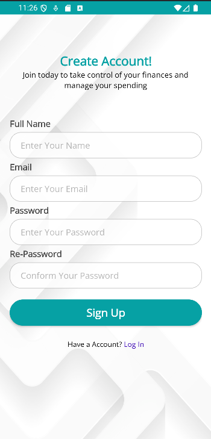
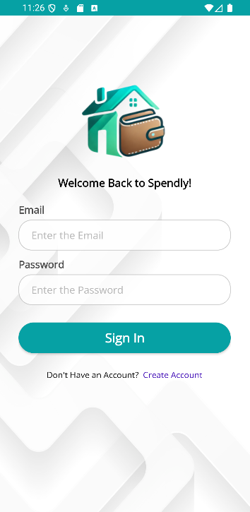
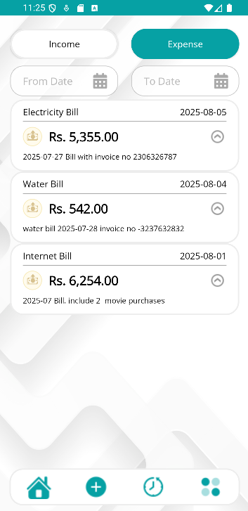
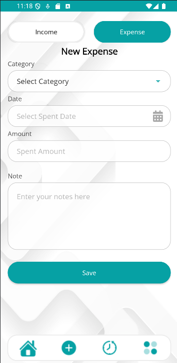
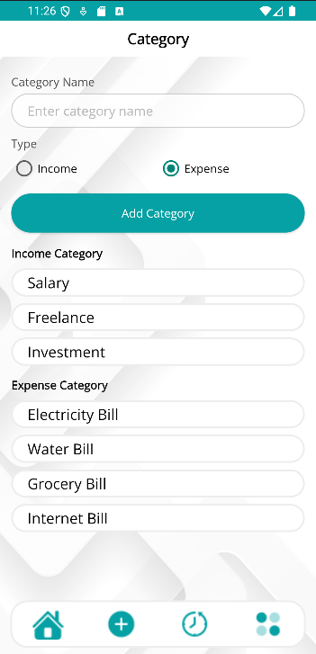

# Spendly - Finance Assistant Mobile App 📱💰

A comprehensive personal finance mobile application built with Kotlin for Android, featuring expense tracking, user input validation, and persistent data storage to help users manage their finances effectively.

## 🚀 Features

- **Expense Tracking**: Record and categorize your daily expenses
- **Data Validation**: Robust user input validation for data integrity
- **Persistent Storage**: SQLite database for reliable data storage
- **Interactive Charts**: Visual representation of spending patterns using MPAndroidChart
- **User-Friendly Interface**: Modern Material Design UI
- **Automatic Database Setup**: Database created automatically on first signup

## 🛠️ Tech Stack

- **Programming Language**: Kotlin
- **Database**: SQLite
- **IDE**: Android Studio
- **UI Framework**: Android SDK with Material Design Components
- **Charts**: MPAndroidChart for data visualization

## 📋 Prerequisites

Before setting up the project, ensure you have the following installed:

- **Android Studio**: Latest stable version (recommended)
- **JDK**: Version 17 or compatible
- **Android SDK**: API Level 32 (Compile SDK)
- **Minimum Android Version**: API Level 19 (Android 4.4 KitKat)
- **Gradle**: Version 7.3.3
- **Android Gradle Plugin**: Version 7.2.2

## ⚙️ Project Configuration

### Gradle Specifications
```gradle
compileSdk 32
minSdk 19
targetSdk 32

gradle_version = "7.3.3"
gradle_plugin_version = "7.2.2"
```

### Dependencies
```gradle
dependencies {
    implementation 'androidx.appcompat:appcompat:1.3.0'
    implementation 'androidx.core:core-ktx:1.7.0'
    implementation 'androidx.constraintlayout:constraintlayout:2.0.4'
    implementation 'com.google.android.material:material:1.4.0'
    implementation 'com.github.PhilJay:MPAndroidChart:v3.1.0'
    
    testImplementation 'junit:junit:1.2.1'
    androidTestImplementation 'androidx.test.espresso:espresso-core:3.6.1'
}
```

## 🔧 Setup Instructions

### 1. Clone the Repository
```bash
git clone https://github.com/JaniduChamika/Mobile-home-account-asistant.git
cd Mobile-home-account-asistant
```

### 2. Open in Android Studio
1. Launch Android Studio
2. Select "Open an existing project"
3. Navigate to the cloned repository folder
4. Click "OK" to open the project

### 3. Configure JDK
1. Go to `File` > `Project Structure`
2. Under `SDK Location`, set `JDK Location` to JDK 17
3. Click "Apply" and "OK"

### 4. Sync Project
1. Android Studio should automatically prompt to sync
2. If not, click `File` > `Sync Project with Gradle Files`
3. Wait for the sync to complete

### 5. Verify Dependencies
Ensure all dependencies are properly downloaded. If you encounter issues:
1. Go to `File` > `Invalidate Caches and Restart`
2. Select "Invalidate and Restart"

## 🏃‍♂️ Running the Application

1. Connect an Android device (API 19+) or start an emulator
2. Enable USB Debugging on your device (if using physical device)
3. Click the "Run" button (green triangle) in Android Studio
4. Select your target device
5. The app will build and install automatically

## 📱 First Time Setup

1. **Launch the App**: Open Spendly on your device
2. **Sign Up**: Create your account on the first launch
3. **Database Initialization**: SQLite database will be created automatically
4. **Start Tracking**: Begin adding your expenses and financial data

## 🎨 UI Design

<!-- Add your UI screenshots and design mockups here -->

### Screenshots
| Sign UP| Sign In |
|-----------------|-----------------------|
|  |  |

| Home | Expenses Hisotry |
|----------------------------|----------------------------|
|  |  |

| New Expense | Category |
|------------------------|-------------------|
|  |  |

### Design System
- **Color Scheme**: Material Design color palette
- **Typography**: Roboto font family
- **Components**: Material Design Components (MDC)
- **Charts**: Interactive charts powered by MPAndroidChart

### UI Components
- Modern card-based layouts
- Floating Action Buttons for quick actions
- Bottom navigation for easy access
- Custom chart visualizations
- Form validation with real-time feedback

## 🐛 Troubleshooting

### Common Issues

**Build Fails:**
- Ensure JDK 17 is properly configured
- Check internet connection for dependency downloads
- Try `Build` > `Clean Project` then `Build` > `Rebuild Project`

**App Crashes on Startup:**
- Verify minimum SDK version (API 19+)
- Check device compatibility
- Review LogCat for error details

**Database Issues:**
- Database is created automatically on first signup
- If issues persist, clear app data and restart

**Gradle Sync Issues:**
```bash
# In terminal, run:
./gradlew clean
./gradlew build --refresh-dependencies
```

## 🤝 Contributing

Contributions are what make the open source community such an amazing place to learn, inspire, and create. Any contributions you make are **greatly appreciated**.

If you have a suggestion that would make this better, please fork the repo and create a pull request. You can also simply open an issue with the tag "enhancement".

1. Fork the Project
2. Create your Feature Branch (`git checkout -b feature/AmazingFeature`)
3. Commit your Changes (`git commit -m 'Add some AmazingFeature'`)
4. Push to the Branch (`git push origin feature/AmazingFeature`)
5. Open a Pull Request

Don't forget to give the project a star! Thanks again!

## 📞 Support

If you encounter any issues or have questions:

- Create an issue in the GitHub repository
- Check the troubleshooting section above
- Review Android Studio's LogCat for detailed error messages

## 🏗️ Built With

- [Kotlin](https://kotlinlang.org/) - Programming Language
- [Android SDK](https://developer.android.com/) - Mobile Development Framework
- [SQLite](https://sqlite.org/) - Database
- [MPAndroidChart](https://github.com/PhilJay/MPAndroidChart) - Chart Library
- [Material Components](https://material.io/develop/android/) - UI Components

---
